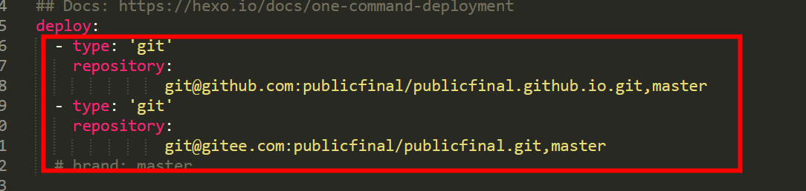
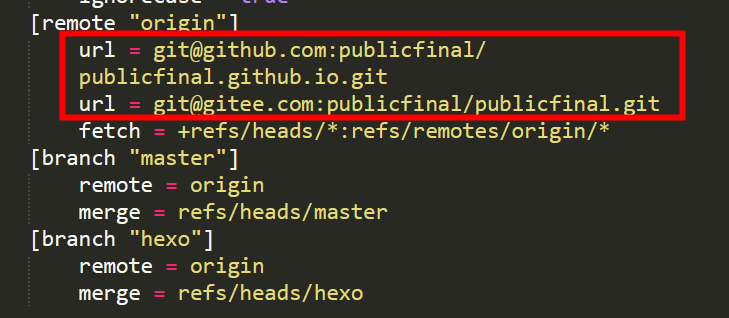

---


title: Hexo个人博客搭建
categories: 
	- 前言
	- Hexo个人博客搭建
tags: ["Hexo","next主题","gitee部署","github部署"]
---

```
作者: 左岸小镇_梦归
企鹅: 2427419219
邮箱: publicfinal@163.com
博客: https://publicfinal.top/
备用: https://publicfinal.gitee.io/
```

# Hexo个人博客搭建

官方文档：https://hexo.io/zh-cn/docs/

```apl
npm install -g hexo-cli #全局安装hexo
npm install hexo #当前包下安装
hexo -v #查看hexo版本
hexo init <folder>  #本地构建hexo网站包,folder文件夹
cd <folder>  #切换到folder文件夹下
hexo clean #清空本地的构建文件
hexo g #构建博客网页（将md文件转换成静态html）
hexo s #本地运行
npm install hexo-deployer-git --save #安装 hexo-deployer-git。
hexo d #部署到远端
#使用以上命令就可以完成个人博客的创建啦，想要好看就需要自己设置主题
```

部署完成后一定要新建一个分支，保存博客源代码文件。方便下次写完博客后重新更新博客信息

```apl
#从远端分支拉取博客源代码后,在博客文件夹下是无法执行 hexo指令的，这个时候不要怀疑是你环境变量的问题。这是因为mode_modules 这个文件夹在上传git时候被 .gitignore这个忽略文件忽略了。
#在文件夹下执行
npm install 
#node.js 会自动根据package.json文件下载所需的node_modules项目文件
#这个时候你会发现，博客文件夹下又可以执行hexo 指令了。
```

<!-- more -->

## 概述

### 什么是 Hexo？

Hexo 是一个快速、简洁且高效的博客框架。Hexo 使用 [Markdown](http://daringfireball.net/projects/markdown/)（或其他渲染引擎）解析文章，在几秒内，即可利用靓丽的主题生成静态网页。

#### 安装前提

安装 Hexo 相当简单，只需要先安装下列应用程序即可：

- [Node.js](http://nodejs.org/) (Node.js 版本需不低于 10.13，建议使用 Node.js 12.0 及以上版本)
- [Git](http://git-scm.com/)

如果您的电脑中已经安装上述必备程序，那么恭喜您！你可以直接前往 [安装 Hexo](https://hexo.io/zh-cn/docs/#安装-Hexo) 步骤。

如果您的电脑中尚未安装所需要的程序，请根据以下安装指示完成安装。

```apl
查看node.js和git是否安装成功
node -v  #检查node版本 
git -v   #检查git版本
```


#### 安装 Hexo

所有必备的应用程序安装完成后，即可使用 npm 安装 Hexo。

```apl
$ npm install -g hexo-cli
```

==-g 全局安装== 

#### 进阶安装和使用

对于熟悉 npm 的进阶用户，可以仅局部安装 `hexo` 包。

```apl
$ npm install hexo
```

安装以后，可以使用以下两种方式执行 Hexo：

1. `npx hexo <command>`
2. 将 Hexo 所在的目录下的 `node_modules` 添加到环境变量之中即可直接使用 `hexo <command>`：

## 建站

安装 Hexo 完成后，请执行下列命令，Hexo 将会在指定文件夹中新建所需要的文件。

```apl
$ hexo init <folder>
$ cd <folder>
$ npm install
```

新建完成后，指定文件夹的目录如下：

```apl
.
├── _config.yml  #全局的配置文件信息
├── package.json #应用程序的信息,node.js需要使用
├── scaffolds #模板文件夹
├── source  #资源文件夹，用于存放用户资源
|   ├── _drafts
|   └── _posts #除此文件夹外其他的开头命名为 _ (下划线)的文件 / 文件夹和隐藏的文件将会被忽略Markdown 和 HTML 文件会被解析并放到 public 文件夹，而其他文件会被拷贝过去。
└── themes  #主题 文件夹。Hexo 会根据主题来生成静态页面。
```


## 配置

您可以在 `_config.yml` 中修改大部分的配置。

### 网站

| 参数          | 描述                                                         |
| :------------ | :----------------------------------------------------------- |
| `title`       | 网站标题                                                     |
| `subtitle`    | 网站副标题                                                   |
| `description` | 网站描述                                                     |
| `keywords`    | 网站的关键词。支持多个关键词。                               |
| `author`      | 您的名字                                                     |
| `language`    | 网站使用的语言。对于简体中文用户来说，使用不同的主题可能需要设置成不同的值，请参考你的主题的文档自行设置，常见的有 `zh-Hans`和 `zh-CN`。 |
| `timezone`    | 网站时区。Hexo 默认使用您电脑的时区。请参考 [时区列表](https://en.wikipedia.org/wiki/List_of_tz_database_time_zones) 进行设置，如 `America/New_York`, `Japan`, 和 `UTC` 。一般的，对于中国大陆地区可以使用 `Asia/Shanghai`。 |

其中，`description`主要用于SEO，告诉搜索引擎一个关于您站点的简单描述，通常建议在其中包含您网站的关键词。`author`参数用于主题显示文章的作者。

### 网址

| 参数                         | 描述                                                         | 默认值                      |
| :--------------------------- | :----------------------------------------------------------- | :-------------------------- |
| `url`                        | 网址, 必须以 `http://` 或 `https://` 开头                    |                             |
| `root`                       | 网站根目录                                                   | `url's pathname`            |
| `permalink`                  | 文章的 [永久链接](https://hexo.io/zh-cn/docs/permalinks) 格式 | `:year/:month/:day/:title/` |
| `permalink_defaults`         | 永久链接中各部分的默认值                                     |                             |
| `pretty_urls`                | 改写 [`permalink`](https://hexo.io/zh-cn/docs/variables) 的值来美化 URL |                             |
| `pretty_urls.trailing_index` | 是否在永久链接中保留尾部的 `index.html`，设置为 `false` 时去除 | `true`                      |
| `pretty_urls.trailing_html`  | 是否在永久链接中保留尾部的 `.html`, 设置为 `false` 时去除 (*对尾部的 `index.html`无效*) | `true`                      |

> 网站存放在子目录
>
> 如果您的网站存放在子目录中，例如 `http://example.com/blog`，则请将您的 `url` 设为 `http://example.com/blog` 并把 `root` 设为 `/blog/`。

例如：

```
# 比如，一个页面的永久链接是 http://example.com/foo/bar/index.html
pretty_urls:
  trailing_index: false
# 此时页面的永久链接会变为 http://example.com/foo/bar/
```

## 部署

github 或者gitee创建项目库

Hexo 提供了快速方便的一键部署功能，让您只需一条命令就能将网站部署到服务器上。

```
$ hexo deploy
```

在开始之前，您必须先在 `_config.yml` 中修改参数，一个正确的部署配置中至少要有 `type` 参数，例如：

```yml
deploy:
  type: git
```

您可同时使用多个 deployer，Hexo 会依照顺序执行每个 deployer。

```yml
deploy:
- type: git
  repo:
- type: heroku
  repo:
```

在blog文件夹下_config.yml中进行配置



创建新的分支 例如：hexo 将项目代码保存到新的分支中。

```apl
git init  # 创建本地版本库
```

修改.git文件夹下config文件



